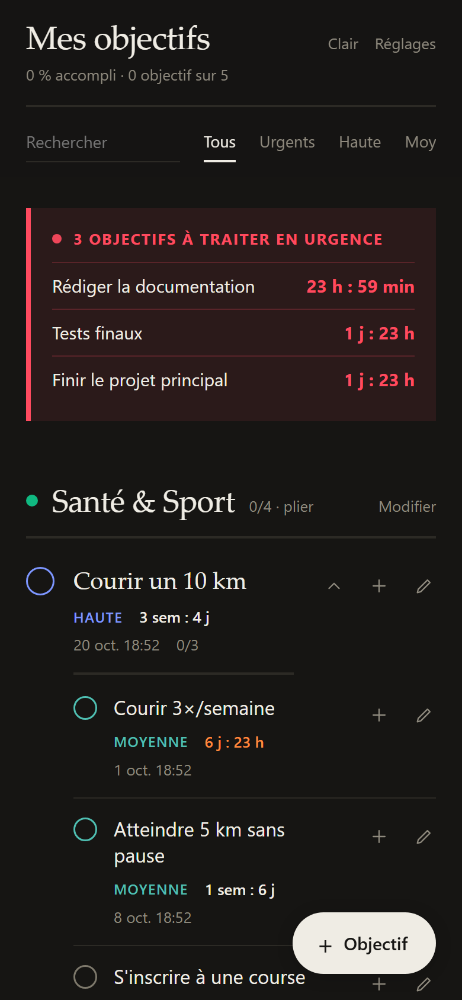

# 🎯 Mes objectifs

Application web installable (PWA) pour organiser ses objectifs par catégories, avec priorités,
sous-objectifs et compte à rebours jusqu'à chaque échéance.

**▶ [Ouvrir l'application](https://tanim-veer.github.io/suivi-objectifs/)** — fonctionne aussi hors ligne, et s'installe sur téléphone (« Ajouter à l'écran d'accueil »).

  

## Fonctionnalités

- **Catégories** personnalisables (santé, finances, études…), repliables
- **Priorités** haute, moyenne ou basse, et filtres par priorité
- **Sous-objectifs** pour découper un objectif en étapes, avec la progression affichée (ex. 1/3)
- **Compte à rebours** jusqu'à l'échéance, et encart des objectifs **urgents** en haut de page
- **Notifications** à l'approche d'une échéance
- Recherche, thème clair ou sombre
- **Export / import** des données en JSON pour les sauvegarder

## Technique

- HTML, CSS et JavaScript, sans framework ni dépendance
- Données stockées dans le navigateur (`localStorage`) : aucun compte ni serveur
- Service worker et manifeste web pour le mode hors ligne et l'installation
- Hébergé sur GitHub Pages

## Lancer en local

Aucune installation : il suffit de servir le dossier, par exemple avec `python -m http.server`,
puis d'ouvrir `http://localhost:8000`. Le service worker a besoin d'être servi en HTTP : ouvrir
`index.html` directement depuis l'explorateur de fichiers ne l'active pas.
